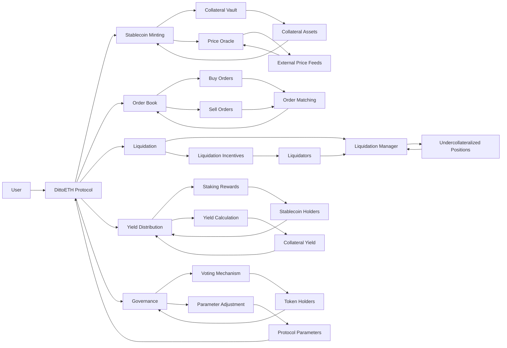

## 1. Introduction
DittoETH, a decentralized stablecoin protocol that utilizes an order book design to provide supercharged staking yield. This analysis report presents an in-depth analysis of the DittoETH codebase, focusing on centralization risks, Mechanism review, and Systemic risks. The analysis aims to provide actionable insights, improvement points, and a comprehensive understanding of the protocol's architecture and mechanisms.

## 2. Approach
1. A detailed examination of the smart contract code to identify potential issues, vulnerabilities, and areas for improvement.
2. An evaluation of the protocol's overall design, including its components, interactions, and potential risks.
3. A review of the key mechanisms, such as stablecoin minting, order book matching, liquidation, and yield distribution, to assess their functionality and potential vulnerabilities.
4. An identification of centralization risks, admin control abuse, and systemic risks that could impact the protocol's security and stability.
5. Actionable suggestions and improvement points based on the findings of the analysis.

## 3. Architecture Overview
### 3.1. Conceptual Diagram
Illustrating the high-level architecture of the DittoETH protocol, showcasing the main components, their interactions, and the flow of data and assets.



1. User: Represents the end-users who interact with the DittoETH protocol.

2. DittoETH Protocol: The core protocol that encompasses various functionalities.

3. Stablecoin Minting: Allows users to mint stablecoins by depositing collateral assets.
   - Collateral Vault: Stores the deposited collateral assets.
   - Price Oracle: Provides accurate price data for collateral assets and stablecoins.

4. Order Book: Facilitates the matching of buy and sell orders for stablecoins.
   - Buy Orders: Represents the demand for stablecoins.
   - Sell Orders: Represents the supply of stablecoins.
   - Order Matching: Matches buy and sell orders based on price and quantity.

5. Liquidation: Manages undercollateralized positions and initiates liquidation when necessary.
   - Liquidation Manager: Monitors collateralization ratios and triggers liquidations.
   - Liquidation Incentives: Encourages liquidators to participate in the liquidation process.

6. Yield Distribution: Distributes staking rewards to stablecoin holders.
   - Staking Rewards: Represents the yield earned by stablecoin holders.
   - Yield Calculation: Determines the yield distribution based on stablecoin holdings.

7. Governance: Enables token holders to participate in protocol governance.
   - Voting Mechanism: Allows token holders to vote on protocol proposals.
   - Parameter Adjustment: Enables the adjustment of protocol parameters through governance.

The arrows in the diagram represent the flow of data and assets between different components. For example:
- Users deposit collateral assets into the Collateral Vault.
- The Price Oracle fetches price data from external price feeds.
- Buy and sell orders are placed in the Order Book and matched through the Order Matching process.
- The Liquidation Manager monitors undercollateralized positions and triggers liquidations.
- Liquidators are incentivized to participate in the liquidation process.
- Stablecoin holders receive staking rewards based on the yield calculation.
- Token holders participate in governance by voting on proposals and adjusting protocol parameters.

Orderbook matching logic and the complexities introduced to save gas, focusing on the handling of Short Orders, oracle price caching, and the impact on the hint system.
--------------------------------

1. Short Order Matching:
   The orderbook matching logic ensures that Short Orders can only be matched at or above the oracle price, unlike bids and asks. This is enforced in the [`createLimitShort`](https://github.com/code-423n4/2024-03-dittoeth/blob/91faf46078bb6fe8ce9f55bcb717e5d2d302d22e/contracts/facets/ShortOrdersFacet.sol#L35-L91) function

   ```solidity
   function createLimitShort(
       address asset,
       uint80 price,
       uint88 ercAmount,
       MTypes.OrderHint[] memory orderHintArray,
       uint16[] memory shortHintArray,
       uint16 shortOrderCR
   ) external {
       // ...
       p.oraclePrice = LibOracle.getSavedOrSpotOraclePrice(asset);
       if (LibSRUtil.checkRecoveryModeViolation(asset, cr, p.oraclePrice)) {
           revert Errors.BelowRecoveryModeCR();
       }

       if (incomingShort.price < p.oraclePrice) {
           LibOrders.addShort(asset, incomingShort, orderHintArray);
       } else {
           LibOrders.sellMatchAlgo(asset, incomingShort, orderHintArray, p.minAskEth);
       }
   }
   ```

   the `incomingShort.price` is compared with the `p.oraclePrice`. If the Short Order's price is less than the oracle price, it is added to the orderbook using `LibOrders.addShort`. Otherwise, it is matched using `LibOrders.sellMatchAlgo`.

   - The `minShortErc` parameter is used in the `PrimaryLiquidationFacet.sol` contract's `liquidate` function to ensure that a ShortRecord has a minimum amount of `ercDebt` to be eligible for liquidation.
   - The relevant code snippet is:

     ```solidity
     function liquidate(address asset, address shorter, uint8 id, uint16[] memory shortHintArray)
         external
         isNotFrozen(asset)
         nonReentrant
         onlyValidShortRecord(asset, shorter, id)
         returns (uint88, uint88)
     {
         // ...
         LibSRUtil.checkCancelShortOrder({
             asset: asset,
             initialStatus: s.shortRecords[asset][shorter][id].status,
             shortOrderId: shortOrderId,
             shortRecordId: id,
             shorter: shorter
         });
         // ...
     }
     ```

   - The `LibSRUtil.checkCancelShortOrder` function is called to ensure that the ShortRecord's `ercDebt` is above `minShortErc` and to cancel the associated short order if necessary.

   - The vulnerability arises when the `minShortErc` parameter is not set appropriately.
   - If `minShortErc` is set too low:
     - Liquidators may not have sufficient incentive to liquidate risky debt because the potential caller fee they earn (based on the liquidated collateral) may not cover the costs and effort involved in the liquidation process.
     - This can lead to a situation where risky ShortRecords with low `ercDebt` remain unliquidated, allowing the debt to accumulate and potentially threatening the stability of the system.
   - If `minShortErc` is set too high:
     - Legitimate ShortRecords with `ercDebt` below the high threshold may not be eligible for liquidation, even if they pose a risk to the system.
     - This can prevent timely liquidation of risky debt and lead to a buildup of unhealthy positions in the system.

### Mitigation
     - Carefully analyze and determine an appropriate value for `minShortErc` that strikes a balance between incentivizing liquidations and allowing for the liquidation of risky positions.
     - Regularly review and adjust the `minShortErc` parameter based on market conditions, liquidator behavior, and the overall health of the system.
     - Implement monitoring and alerting mechanisms to detect and notify when the system accumulates a significant amount of risky debt or when liquidations are not occurring as expected.
     - Consider introducing additional incentives or mechanisms to encourage liquidators to actively manage risky positions, even if the `ercDebt` is relatively low.
   - Here's an example of how the `minShortErc` parameter could be dynamically adjusted based on system conditions:

     ```solidity
     function adjustMinShortErc(uint256 newMinShortErc) external onlyOwner {
         require(newMinShortErc > 0, "Invalid minShortErc value");
         uint256 oldMinShortErc = minShortErc;
         minShortErc = newMinShortErc;
         emit MinShortErcUpdated(oldMinShortErc, newMinShortErc);
     }
     ```

     In this example, the `adjustMinShortErc` function allows the contract owner to dynamically update the `minShortErc` parameter based on changing market conditions or system requirements. The function includes a simple validation check and emits an event to track the parameter update.

### 2. Oracle Price Caching:
   The system employs an oracle price caching mechanism with a 15-minute window and a 0.5% buffer to save gas. The cached oracle price is used for various calculations and comparisons. The caching logic is implemented in the [`LibOracle.getSavedOrSpotOraclePrice`](https://github.com/code-423n4/2024-03-dittoeth/blob/91faf46078bb6fe8ce9f55bcb717e5d2d302d22e/contracts/libraries/LibOracle.sol#L168-L175) function

   ```solidity
   function getSavedOrSpotOraclePrice(address asset) internal view returns (uint256) {
       if (LibOrders.getOffsetTime() - getTime(asset) < 15 minutes) {
           return getPrice(asset);
       } else {
           return getOraclePrice(asset);
       }
   }
   ```

   If the time difference between the current offset time and the last saved oracle time is less than 15 minutes, the cached price is returned using `getPrice(asset)`. Otherwise, the fresh oracle price is fetched using `getOraclePrice(asset)`.

   The caching mechanism helps reduce the gas cost of fetching the oracle price frequently. However, it introduces a potential risk if the actual oracle price deviates significantly from the cached price within the 15-minute window. This could lead to incorrect price comparisons and affect the matching logic.

### 3. Hint System and Oracle Price Changes:
   The hint system is used to optimize the placement of orders in the orderbook and reduce gas costs. When the oracle price changes, the hints provided by users may become invalid. The system handles this scenario by allowing a 0.5% buffer and matching backwards until reaching the correct "starting short id".

   In the [`createBid`](https://github.com/code-423n4/2024-03-dittoeth/blob/91faf46078bb6fe8ce9f55bcb717e5d2d302d22e/contracts/facets/BidOrdersFacet.sol#L40-L51) function, the [`updateOracleAndStartingShortViaThreshold`](https://github.com/code-423n4/2024-03-dittoeth/blob/91faf46078bb6fe8ce9f55bcb717e5d2d302d22e/contracts/facets/BidOrdersFacet.sol#L108) function is called to update the oracle price and the starting short id if the match price differs from the saved oracle price by more than 0.5%: And [here Line 106-108](https://github.com/code-423n4/2024-03-dittoeth/blob/91faf46078bb6fe8ce9f55bcb717e5d2d302d22e/contracts/facets/BidOrdersFacet.sol#L106-L108)

   ```solidity
   function createBid(
       address asset,
       uint80 price,
       uint88 ercAmount,
       bool isMarketOrder,
       MTypes.OrderHint[] calldata orderHintArray,
       uint16[] calldata shortHintArray
   ) external {
       // ...
       STypes.Order memory lowestSell = _getLowestSell(asset, b);
       if (incomingBid.price >= lowestSell.price && (lowestSell.orderType == O.LimitAsk || lowestSell.orderType == O.LimitShort)) {
           LibOrders.updateOracleAndStartingShortViaThreshold(asset, LibOracle.getPrice(asset), incomingBid, shortHintArray);
           // ...
       }
       // ...
   }
   ```

   If the oracle price changes and the hint becomes invalid, the system matches backwards from the provided hint until it reaches the correct "starting short id". This process is implemented in the [`_shortDirectionHandler`](https://github.com/code-423n4/2024-03-dittoeth/blob/91faf46078bb6fe8ce9f55bcb717e5d2d302d22e/contracts/facets/BidOrdersFacet.sol#L358) function: And [Here Line 392-406](https://github.com/code-423n4/2024-03-dittoeth/blob/91faf46078bb6fe8ce9f55bcb717e5d2d302d22e/contracts/facets/BidOrdersFacet.sol#L392-L408)

   ```solidity
   function _shortDirectionHandler(
       address asset,
       STypes.Order memory lowestSell,
       STypes.Order memory incomingBid,
       MTypes.BidMatchAlgo memory b
   ) private view {
       // ...
       if (prevPrice >= b.oraclePrice && !b.isMovingFwd) {
           b.isMovingBack = true;
           b.shortId = b.prevShortId;
       } else if (prevPrice < b.oraclePrice && !b.isMovingFwd) {
           b.firstShortIdBelowOracle = b.prevShortId;
           b.shortId = s.shorts[asset][b.shortHintId].nextId;

           STypes.Order storage nextShort = s.shorts[asset][lowestSell.nextId];
           if (b.shortId != C.HEAD && nextShort.price <= incomingBid.price) {
               b.isMovingFwd = true;
           }
       } else if (b.isMovingFwd) {
           b.shortId = lowestSell.nextId;
       }
   }
   ```

   The `_shortDirectionHandler` function determines the direction of matching (backwards or forwards) based on the comparison of the previous short order's price with the oracle price. It updates the `shortId` accordingly to match backwards until reaching the correct "starting short id".

### 4. Potential Risks and Considerations:
   - The 15-minute caching window for the oracle price introduces a risk if the actual price deviates significantly within that window. This could lead to incorrect price comparisons and affect the matching logic.
   - The 0.5% buffer allowed for matching when the oracle price changes may not be sufficient in highly volatile market conditions. It could result in incorrect matching or failure to match orders as intended.
   - The backward matching process to reach the correct "starting short id" may introduce additional gas costs and complexity to the system. It is important to thoroughly test and optimize this process to ensure its efficiency and correctness.

To mitigate these risks, consider the following:
--------------------------------
- Regularly review and assess the appropriateness of the 15-minute caching window and the 0.5% buffer based on market conditions and system performance.
- Implement robust error handling and fallback mechanisms to handle scenarios where the oracle price deviates significantly or the matching process encounters unexpected behavior.
- Conduct thorough edge cases and extreme market conditions, to ensure the correctness and efficiency of the orderbook matching logic and the hint system.


Analysis of the concept of `minShortErc`, verify the incentives for primary liquidators, and investigate the edge case related to `ercDebt` requirements and `ercDebtRate`.
----------------------------------------------------------------

1. `minShortErc` and Liquidator Incentives:
   The `minShortErc` parameter represents the minimum amount of `ercDebt` that a ShortRecord must have to be considered valid and eligible for liquidation. This parameter is crucial in ensuring that primary liquidators have sufficient incentive to liquidate risky debt.

   In the `PrimaryLiquidationFacet.sol` contract, the `liquidate` function checks if the ShortRecord's `ercDebt` is above `minShortErc` before proceeding with the liquidation:


   The `LibSRUtil.checkCancelShortOrder` function ensures that the ShortRecord's `ercDebt` is above `minShortErc` and cancels the associated short order if necessary (more on this in the next section).

   Liquidators are incentivized to liquidate risky debt because they receive a caller fee (`callerFeePct`) based on the liquidated collateral. The caller fee is calculated as a percentage of the filled ETH amount during the liquidation:

   By ensuring that ShortRecords have a minimum `ercDebt` (`minShortErc`), the protocol guarantees that liquidations are worthwhile for liquidators, as they can earn a meaningful caller fee for their efforts.

2. ShortRecord `ercDebt` and Short Order Cancellation:
   Every ShortRecord should either contain enough `ercDebt` or have access to enough `ercDebt` through the cancellation of the associated short order. This ensures that ShortRecords maintain a sufficient debt level for liquidation.

   In the [`LibSRUtil.checkCancelShortOrder`](https://github.com/code-423n4/2024-03-dittoeth/blob/91faf46078bb6fe8ce9f55bcb717e5d2d302d22e/contracts/libraries/LibSRUtil.sol#L49-L70) function, the protocol checks if the ShortRecord's `ercDebt` is below `minShortErc`. If it is, and the ShortRecord has an associated short order (status is `SR.PartialFill`), the short order is canceled:

   ```solidity
   function checkCancelShortOrder(address asset, SR initialStatus, uint16 shortOrderId, uint8 shortRecordId, address shorter)
       internal
       returns (bool isCancelled)
   {
       // ...
       if (shorter == msg.sender) {
           // If call comes from exitShort() or combineShorts() then always cancel
           LibOrders.cancelShort(asset, shortOrderId);
           assert(shortRecord.status != SR.PartialFill);
           return true;
       } else if (shortRecord.ercDebt < LibAsset.minShortErc(asset)) {
           // If call comes from liquidate() and SR ercDebt under minShortErc
           LibOrders.cancelShort(asset, shortOrderId);
           return true;
       }
   }
   ```

   By canceling the short order, the `ercDebt` and collateral associated with the order are added to the ShortRecord, effectively increasing its `ercDebt` to meet the `minShortErc` requirement.

   This mechanism ensures that ShortRecords always have access to enough `ercDebt`, either directly or through the cancellation of the associated short order, to maintain a sufficient level of debt for liquidation.

3. Edge Case: `ercDebt` Requirements and `ercDebtRate`:
   There is an edge case mentioned in the known issues, where the `ercDebt` requirements of a ShortRecord can be met through the application of the `ercDebtRate`.

   The `ercDebtRate` is a parameter that represents the socialized debt rate across all ShortRecords. It is used to adjust the `ercDebt` of ShortRecords based on the overall debt level of the system.

   In the [`LibSRUtil.updateErcDebt`](https://github.com/code-423n4/2024-03-dittoeth/blob/91faf46078bb6fe8ce9f55bcb717e5d2d302d22e/contracts/libraries/LibSRUtil.sol#L151-L161) function, the `ercDebt` of a ShortRecord is updated based on the `ercDebtRate`:

   ```solidity
   function updateErcDebt(STypes.ShortRecord storage short, address asset) internal {
       // ...
       uint64 ercDebtRate = s.asset[asset].ercDebtRate;
       uint88 ercDebt = short.ercDebt.mulU88(ercDebtRate - short.ercDebtRate);

       if (ercDebt > 0) {
           short.ercDebt += ercDebt;
           short.ercDebtRate = ercDebtRate;
       }
   }
   ```

   If the `ercDebtRate` increases significantly, it could potentially raise the `ercDebt` of a ShortRecord above `minShortErc`, even if the ShortRecord's original `ercDebt` was below the threshold.

> This edge case could lead to a situation where a ShortRecord that previously did not meet the `minShortErc` requirement suddenly becomes eligible for liquidation due to the application of the `ercDebtRate`.

> While this edge case may be rare, it is important to consider its potential impact on the liquidation process and the incentives for liquidators. It may be necessary to monitor and manage the `ercDebtRate` carefully to avoid unexpected behavior or unintended consequences.

4. Recommendations:
   - Regularly review and adjust the `minShortErc` parameter to ensure that it provides sufficient incentive for liquidators to liquidate risky debt, considering factors such as market conditions, collateral values, and liquidation costs.
   - Monitor the behavior of the `ercDebtRate` and its impact on ShortRecord `ercDebt` levels. Consider implementing safeguards or checks to prevent unintended consequences arising from the edge case mentioned above.
   - Conduct thorough testing and analysis of the liquidation process, including scenarios where ShortRecords have low `ercDebt` and the `ercDebtRate` is applied, to identify any potential issues or unintended behavior.
   - Provide clear documentation and guidelines for liquidators, explaining the incentives, requirements, and potential edge cases related to liquidating ShortRecords.

Managing the `minShortErc` parameter, ensuring that ShortRecords have access to sufficient `ercDebt`, and considering the potential impact of the `ercDebtRate`, the protocol can maintain a robust liquidation process and provide appropriate incentives for liquidators to manage risky debt effectively.

Based on analysis of the `minShortErc` concept, liquidator incentives, and the edge case related to `ercDebt` requirements and `ercDebtRate`, there are a few potential weaknesses and entry points to consider:
------------------------------------------------------------
1. Improper Setting of `minShortErc`:
   - If the `minShortErc` parameter is set too low, it may not provide sufficient incentive for liquidators to liquidate risky debt. Liquidators may find it uneconomical to perform liquidations if the potential caller fee is not high enough to cover the costs and effort involved.
   - On the other hand, if `minShortErc` is set too high, it could prevent legitimate ShortRecords from being liquidated, leading to a buildup of risky debt in the system.
   - Entry: An attacker could exploit an improperly set `minShortErc` by creating multiple ShortRecords with `ercDebt` just below the threshold, knowing that liquidators may not be incentivized to liquidate them. This could lead to a concentration of risky debt that is not being adequately managed.

2. Manipulation of `ercDebtRate`:
   - The edge case mentioned in the known issues highlights the potential for the `ercDebtRate` to inflate the `ercDebt` of ShortRecords, causing them to meet the `minShortErc` requirement even if they originally had low debt.
   - If an attacker can manipulate the `ercDebtRate`, either directly or indirectly, they could potentially trigger unexpected liquidations or alter the incentives for liquidators.
   - Entry: An attacker may attempt to exploit the `ercDebtRate` mechanism by creating a large number of ShortRecords with low `ercDebt`, and then manipulate the system to increase the `ercDebtRate`. This could artificially inflate the `ercDebt` of these ShortRecords, making them appear as valuable targets for liquidation and potentially overwhelming the liquidation process.

3. Insufficient Monitoring and Management:
   - If the protocol lacks proper monitoring and management mechanisms for key parameters like `minShortErc` and `ercDebtRate`, it may fail to detect and respond to abnormal situations or unintended consequences.
   - Entry: An attacker could exploit weaknesses in the monitoring and management processes by gradually accumulating risky debt or manipulating system parameters over time, without being detected or addressed by the protocol.

4. Dependence on External Factors:
   - The value of collateral and the overall market conditions can impact the attractiveness and profitability of liquidations for liquidators.
   - Entry: If there are significant fluctuations in collateral prices or market dynamics that reduce the incentives for liquidations, an attacker could take advantage of this situation to accumulate risky debt without facing timely liquidations.

To mitigate these potential weaknesses and entry points, consider the following recommendations:
-----------------------------------------------------------------------------
1. Determine and regularly review the `minShortErc` parameter to ensure it strikes a balance between incentivizing liquidations and not setting the threshold too high.

2. Implement robust monitoring and alerting mechanisms to detect and respond to unusual changes in the `ercDebtRate` or sudden influxes of ShortRecords with low `ercDebt`.

3. Establish clear governance processes and administrative controls to manage critical system parameters, such as `minShortErc` and `ercDebtRate`, and ensure timely intervention when necessary.

5. Provide transparency and education to liquidators and market participants about the incentives, risks, and mechanisms involved in the liquidation process to encourage responsible behavior and mitigate potential exploits.

### 3.2. Architecture Risks and Recommendations
1. Complexity Risk:
   - The DittoETH protocol involves a complex interplay of various components, including the order book, stablecoin minting, and yield distribution mechanisms. This complexity increases the potential for bugs and vulnerabilities.
   - **Recommendation**: Formal verification of the protocol's components to ensure their correctness and robustness.

2. Oracle Dependency Risk:
   - The protocol relies on external price oracles for accurate price data. Any malfunction or manipulation of the oracles could lead to incorrect price information and potential exploits.
   - **Recommendation**: Implement robust oracle management mechanisms, such as using multiple oracles, applying price deviation checks, and establishing a fallback mechanism in case of oracle failures.

3. Liquidity Risk:
   - The stability and effectiveness of the DittoETH protocol depend on sufficient liquidity in the order book. Low liquidity could result in price volatility and difficulty in executing trades.
   - **Recommendation**: Implement incentive mechanisms to encourage liquidity provision, such as offering rewards or reduced fees for market makers.

## 4. Codebase Quality Analysis
### 4.1. Code Structure and Readability
The DittoETH codebase follows a modular structure, with separate contracts and libraries for different functionalities. The code is well-organized and uses clear naming conventions, enhancing readability and maintainability. However, there are certain areas where the code complexity could be reduced, and additional inline comments could be added to explain intricate logic or calculations.

### 4.2. Use of Libraries and Contracts
The protocol makes extensive use of libraries and external contracts to handle specific functionalities, such as order management (`LibOrders`), short position tracking (`LibShortRecord`), and oracle interactions (`LibOracle`). While this modular approach promotes code reusability and maintainability, it is crucial to ensure that these libraries and contracts are thoroughly tested and audited to prevent potential vulnerabilities.

### 4.3. Error Handling and Validation
The codebase includes error handling and validation mechanisms to prevent invalid or unexpected behavior. Custom error types are defined in the `Errors` library, providing informative error messages for different scenarios. However, there are instances where additional validation checks could be implemented to handle edge cases or prevent potential exploits. For example:
- Ensuring that input parameters are within valid ranges.
- Checking for arithmetic overflows and underflows.
- Validating the integrity of external data sources.

### 4.4. Test Coverage and Quality
[Discuss the test coverage and quality of the DittoETH codebase. Mention the types of tests present (unit tests, integration tests, etc.) and any areas that lack sufficient test coverage. Provide recommendations for improving the test suite.]

## 5. Centralization Risks and Admin Control Abuse
### 5.1. Access Control Mechanisms
The DittoETH protocol implements access control mechanisms to restrict certain functions to privileged roles, such as the contract owner or administrators. These mechanisms are typically enforced using modifiers like `onlyOwner` and `onlyAdmin`. However, the concentration of power in a few privileged roles introduces potential risks of centralization and admin control abuse.

### 5.2. Privileged Roles and Functions
We summarize the privileged roles and their corresponding functions in the DittoETH codebase:

| Privileged Role | Functions                                                |
|-----------------|-----------------------------------------------------------|
| Contract Owner  | - Set protocol parameters (e.g., fees, liquidation ratios) |
|                 | - Pause/unpause the protocol                              |
|                 | - Upgrade contract implementation                        |
| Administrator   | - Manage whitelisted assets                               |
|                 | - Adjust risk parameters                                  |
|                 | - Trigger emergency shutdown                              |

### 5.3. Potential Abuse Scenarios
1. Parameter Manipulation:
   - _Description_: The contract owner or administrator could manipulate critical protocol parameters, such as fees, liquidation ratios, or interest rates, to benefit themselves or certain users at the expense of others.
   - _Impact_: Manipulation of parameters could lead to unfair advantages, financial losses for users, and loss of trust in the protocol.

2. Unauthorized Minting:
   - _Description_: The contract owner might have the ability to mint stablecoins without proper collateralization, leading to an inflated supply and devaluation of the stablecoin.
   - _Impact_: Unauthorized minting could undermine the stability and value of the stablecoin, causing significant losses for stablecoin holders.

### 5.4. Recommendations
1. Implement a multi-sig mechanism for critical admin functions to prevent single-point-of-failure risks and require consensus among multiple trusted parties.
2. Establish a robust governance model that involves community participation and decentralized decision-making for protocol upgrades and parameter changes.
3. Conduct regular audits and monitoring of admin activities to detect and prevent potential abuse.
4. Implement time-locks and delay mechanisms for critical functions to allow sufficient time for community review and intervention.

## 6. Mechanism Review
### 6.1. Stablecoin Minting and Redemption
The DittoETH protocol allows users to mint stablecoins by depositing collateral assets into the protocol. The minting process involves the following steps:
1. Users deposit collateral assets (e.g., ETH) into the protocol's vault.
2. The protocol calculates the collateralization ratio based on the deposited collateral and the current price of the stablecoin.
3. If the collateralization ratio meets the required threshold, the corresponding amount of stablecoins is minted and sent to the user.

Stablecoin redemption follows a similar process, where users burn their stablecoins to redeem the underlying collateral assets.

Potential Issues:
- Inaccurate price oracle data could lead to incorrect collateralization ratios and improper minting or redemption of stablecoins.
- Flash loan attacks could be used to manipulate the collateralization ratio and exploit the minting or redemption process.

### 6.2. Order Book Matching
The DittoETH protocol utilizes an order book mechanism to match buy and sell orders for stablecoins. The order book maintains a list of outstanding orders, sorted by price and time priority. When a new order is placed, the protocol attempts to match it with existing orders based on the specified price and quantity.

_Potential Issues_:
- Front-running attacks: Malicious actors could monitor pending transactions and place their own orders with higher gas prices to get priority execution and manipulate the order book.
- Lack of liquidity: If there is insufficient liquidity in the order book, it could lead to large price spreads and difficulty in executing trades.

### 6.3. Liquidation Process
The DittoETH protocol includes a liquidation mechanism to manage undercollateralized positions. When a user's collateralization ratio falls below a predefined threshold, their position becomes eligible for liquidation. Liquidators can then purchase the collateral at a discounted price to restore the collateralization ratio.

_Potential Issues_:
- Liquidation price manipulation: Malicious actors could attempt to manipulate the price oracle data to trigger liquidations and benefit from the discounted collateral purchase.
- Insufficient liquidation incentives: If the liquidation incentives are not adequately designed, there may be a lack of liquidators willing to participate in the process, leading to delayed liquidations and increased risk for the protocol.

### 1. Improper Setting of `minShortErc`:
   - Weakness: The `minShortErc` parameter, if set too low or too high, can lead to insufficient liquidator incentives or a buildup of risky debt.
   - Entry: An attacker can exploit an improperly set `minShortErc` by creating multiple ShortRecords with `ercDebt` just below the threshold, knowing that liquidators may not be incentivized to liquidate them.
   - Points:
     - Implement a dynamic adjustment mechanism for `minShortErc` based on market conditions and system performance.
     - Determine the optimal range for `minShortErc` that balances liquidation efficiency and risk management.
     - Establish a governance process for reviewing and updating `minShortErc` periodically, considering factors such as liquidation activity, system health, and user feedback.
   - High-Depth Insight: The `minShortErc` parameter plays a critical role in ensuring the efficiency and effectiveness of the liquidation process. Striking the right balance is crucial to maintain the stability and integrity of the system. A well-designed and dynamically adjusted `minShortErc` can help prevent the accumulation of risky debt while providing sufficient incentives for liquidators to perform their role.

### 2. Manipulation of `ercDebtRate`:
   - Weakness: The `ercDebtRate` parameter, if manipulated by an attacker, can inflate the `ercDebt` of ShortRecords and trigger unexpected liquidations.
   - Entry: An attacker may attempt to exploit the `ercDebtRate` mechanism by creating a large number of ShortRecords with low `ercDebt` and then manipulating the system to increase the `ercDebtRate`.
   - Points:
     - Implement strict validation and access controls on the `ercDebtRate` parameter to prevent unauthorized manipulation.
     - Introduce rate-limiting mechanisms to restrict the frequency and magnitude of `ercDebtRate` updates.
     - Consider using a time-weighted average or a multi-sig mechanism to update the `ercDebtRate`, reducing the risk of manipulation by a single entity.
   - High-Depth Insight: Ensuring the integrity and stability of the `ercDebtRate` is essential to maintain the fairness and predictability of the liquidation process. By implementing robust controls and validation mechanisms, the protocol can mitigate the risk of manipulation and protect users from unexpected liquidations triggered by inflated `ercDebt` values.

### 3. Liquidation Bounty Vulnerability:
   - Weakness: If the `callerFeePct` is set too high, liquidators may prioritize liquidations based on the bounty rather than the actual risk posed by the positions.
   - Entry: Liquidators may focus on positions with high collateral values, neglecting positions with lower collateral values that may pose a similar or higher risk to the system.
   - Points:
     - Adjust the `callerFeePct` to a more balanced level that provides sufficient incentive for liquidators while not skewing their priorities towards high-value positions.
     - Implement a dynamic adjustment mechanism for the `callerFeePct` based on market conditions and the overall risk profile of the system.
     - Introduce a tiered or weighted bounty system that rewards liquidators more for liquidating high-risk positions, regardless of the collateral value.
   - High-Depth Insight: Aligning the incentives of liquidators with the overall health and stability of the system is crucial to ensure effective risk management. By designing a bounty mechanism that prioritizes the liquidation of high-risk positions, the protocol can encourage a more balanced and efficient allocation of liquidation resources, reducing the potential for systemic risks.

### 4. Access Control Vulnerabilities:
   - Weakness: Insufficient access control mechanisms or improper privilege management can lead to unauthorized actions and potential abuse of power.
   - Entry: An attacker may exploit vulnerabilities in the access control system to gain unauthorized privileges or perform privileged actions.
   - Points:
     - Implement strict access control mechanisms, such as multi-sig approvals or time-locks, for critical actions performed by privileged roles (e.g., admin).
     - Regularly review and audit the access control system to identify and address any potential vulnerabilities or weaknesses.
     - Establish clear governance processes and guidelines for managing privileged roles, including secure key management and regular rotation of privileges.
   - High-Depth Insight: Robust access control is essential to maintain the security and integrity of the protocol. By implementing stringent access control measures and following best practices for privilege management, the protocol can mitigate the risk of unauthorized actions and protect against potential abuse of power.

### 5. Economic Incentive Misalignments:
   - Weakness: Misaligned economic incentives can lead to undesirable behavior or exploitation by participants.
   - Entry: Attackers may identify and exploit loopholes or misalignments in the economic incentive structures to gain unfair advantages or undermine the stability of the system.
   - Points:
     - Conduct thorough economic analysis and simulations to identify potential misalignments or unintended consequences in the incentive structures.
     - Implement mechanisms to detect and prevent exploitative behavior, such as front-running or sandwich attacks.
     - Regularly monitor and assess the effectiveness of the economic incentives, making adjustments as necessary to maintain system stability and fairness.
   - High-Depth Insight: Well-designed economic incentives are crucial for the long-term success and sustainability of the protocol. By carefully analyzing and aligning the incentives of different participants (e.g., users, liquidators, governance token holders), the protocol can create a balanced ecosystem that encourages positive behavior and discourages exploitation.

To further enhance the security and robustness of the protocol, consider the following high-level recommendations
--------------------------------
1. Implement comprehensive test suites, including unit tests, integration tests, and scenario-based tests, to ensure the correctness and reliability of the codebase.
2. Foster a culture of transparency and open communication within the community to encourage collaboration and prompt resolution of identified issues.

### 6.4. Yield Distribution
The DittoETH protocol distributes staking yield to users who hold stablecoins in the protocol. The yield is generated from the collateral assets deposited by users and is distributed proportionally based on the user's stablecoin holdings.

_Potential Issues_:
- Inaccurate yield calculation: Errors in the yield calculation logic could lead to incorrect distribution of yield to users.
- Yield manipulation: Malicious actors could attempt to manipulate the yield distribution by exploiting vulnerabilities or gaming the system.

## 7. Systemic Risks
### 7.1. Oracle Dependency
The DittoETH protocol relies on external price oracles to provide accurate price data for collateral assets and stablecoins. If the price oracles malfunction or are manipulated, it could lead to incorrect pricing information and potential exploits.

_Recommendations_:
- Use multiple reliable price oracles and implement a price aggregation mechanism to mitigate the impact of individual oracle failures.
- Implement price deviation checks and circuit breakers to detect and prevent significant price anomalies.

### 7.1.2 Economic incentives with potential misalignments or loopholes

**1. Liquidation Bounties:**
   The liquidation process in the protocol incentivizes liquidators to actively identify and liquidate undercollateralized positions. The economic incentives for liquidators are as follows:
   - Liquidators receive a caller fee (`callerFeePct`) as a percentage of the liquidated collateral.
   - The caller fee is paid from the liquidated collateral and is intended to cover the gas costs incurred by the liquidator.
   - The liquidation bounty is designed to encourage liquidators to actively monitor and liquidate risky positions.

   _Potential Misalignments or Loopholes:_
   - If the caller fee is set too low, liquidators may not be sufficiently incentivized to perform liquidations, leading to a buildup of risky positions.
   - If the caller fee is set too high, it may incentivize liquidators to prioritize liquidations based on the bounty rather than the actual risk posed by the positions.
   - There is a potential for front-running or sandwich attacks, where liquidators may attempt to manipulate the price or collateral ratio of a position to benefit from the liquidation bounty.

**2. Redemption Fees:**
   The redemption process allows users to redeem their stablecoins for the underlying collateral. The economic incentives related to redemption fees are as follows:
   - Redemption fees are charged as a percentage of the redeemed collateral.
   - The redemption fee is intended to cover the costs associated with the redemption process and to discourage frequent redemptions that may strain the system.
   - The redemption fee is dynamically adjusted based on the redemption volume and time elapsed since the last redemption.

   _Potential Misalignments or Loopholes:_
   - If the redemption fee is set too low, it may incentivize users to frequently redeem their stablecoins, putting pressure on the collateral reserves and increasing the risk of a run on the system.
   - If the redemption fee is set too high, it may discourage users from redeeming their stablecoins, leading to a lack of liquidity and a potential premium or discount on the stablecoin price.
   - The dynamic adjustment of the redemption fee based on volume and time may be susceptible to manipulation by large holders who can strategically time their redemptions to minimize fees.

**3. Yield Distribution:**
   The yield distribution mechanism in the protocol incentivizes users to provide liquidity and participate in the system. The economic incentives related to yield distribution are as follows:
   - Users who hold stablecoins or provide liquidity to the system are entitled to a share of the generated yield.
   - The yield is distributed proportionally based on the user's holdings and the duration of their participation.
   - The yield distribution aims to attract and retain liquidity in the system.

   _Potential Misalignments or Loopholes:_
   - If the yield distribution is not properly balanced, it may lead to uneven distribution of rewards, favoring large holders over smaller participants.
   - The yield distribution mechanism may be vulnerable to yield farming or opportunistic behavior, where users may exploit the system to maximize their yield without providing long-term value.
   - The yield distribution may not adequately incentivize users to maintain a balanced portfolio of stablecoins and collateral, leading to concentration risks.

**4. Other Relevant Mechanisms:**
   - Stability Fees: Stability fees are charged on outstanding stablecoin debt to maintain the stability of the system. If the stability fees are not properly calibrated, it may lead to excessive borrowing or insufficient revenue for the protocol.
   - Liquidation Penalties: Liquidation penalties are imposed on users whose positions are liquidated. If the penalties are too low, it may encourage reckless borrowing behavior. If the penalties are too high, it may deter users from participating in the system.
   - Collateral Ratios: The required collateral ratios for different assets should be carefully determined based on their risk profiles. Inadequate collateral ratios may expose the system to insolvency risks, while overly conservative ratios may limit the capital efficiency of the protocol.

To mitigate potential misalignments and loopholes, consider the following recommendations:
----------------------------------
- Regularly review and adjust the liquidation bounties, redemption fees, and yield distribution parameters based on market conditions and user behavior.
- Implement robust monitoring and analytics to identify and respond to any abnormal or exploitative behavior.
- Consider incorporating time-locks or community governance mechanisms for critical parameter changes to allow for thorough review and consensus.
- Engage with the community and seek feedback to identify potential misalignments or unintended consequences of the economic incentives.

### 7.2. Liquidity and Market Risks
The stability and effectiveness of the DittoETH protocol depend on sufficient liquidity in the order book and the overall market demand for stablecoins. Low liquidity or sudden market shifts could impact the protocol's ability to maintain the stablecoin peg and facilitate trades.

_Recommendations_:
- Implement incentive mechanisms to encourage liquidity provision and market-making activities.
- Establish partnerships with external liquidity providers to ensure a deep and stable order book.

### 7.3. Flash Loan Attacks
Flash loans, which allow borrowing large amounts of assets without collateral, can be used to manipulate the DittoETH protocol by exploiting vulnerabilities or conducting malicious activities.

_Recommendations_:
- Implement proper checks and validations to prevent flash loan attacks, such as requiring collateral for minting and redemption.
- Use reentrancy guards and carefully manage state updates to prevent exploits during flash loan transactions.

### 7.4. Governance Risks
The DittoETH protocol may have a governance mechanism that allows token holders to propose and vote on protocol changes. However, governance risks can arise if the voting power is concentrated among a few large token holders or if malicious actors manipulate the governance process.

_Recommendations_:
- Implement a decentralized governance model that encourages broad participation and prevents the concentration of voting power.
- Establish clear guidelines and procedures for proposing and implementing protocol changes.

## 8. Identified Vulnerabilities and Bugs
### 8.1. Improper Input Validation
- _Description_: The `createLimitShort` function in the `ShortOrdersFacet` contract does not properly validate the `shortOrderCR` parameter, allowing users to create short orders with invalid collateralization ratios.
- Code Snippet: [ShortOrdersFacet.sol#createLimitShort](https://github.com/code-423n4/2024-03-dittoeth/blob/91faf46078bb6fe8ce9f55bcb717e5d2d302d22e/contracts/facets/ShortOrdersFacet.sol#L35-L91)
- Recommendation: Implement proper input validation for the `shortOrderCR` parameter to ensure it falls within the allowed range.

### 8.2. Reentrancy Vulnerability
- Description: The `liquidate` function in the `PrimaryLiquidationFacet` contract is vulnerable to reentrancy attacks, allowing malicious actors to exploit the liquidation process and drain funds.
- Code Snippet: [PrimaryLiquidationFacet.sol#liquidate](https://github.com/code-423n4/2024-03-dittoeth/blob/91faf46078bb6fe8ce9f55bcb717e5d2d302d22e/contracts/facets/PrimaryLiquidationFacet.sol#L47-L90)
- Recommendation: Implement the checks-effects-interactions pattern and use reentrancy guards to prevent reentrancy attacks during the liquidation process.

## 9. Recommendations and Improvement
1. Implement a comprehensive risk management framework to monitor and mitigate systemic risks, such as oracle failures, liquidity issues, and market volatility.
2. Establish a robust governance model that ensures decentralized decision-making and prevents the concentration of power among a few entities.
3. Regularly review and update the protocol's parameters and mechanisms to adapt to changing market conditions and user requirements.
4. Encourage community participation and foster a transparent and inclusive ecosystem around the DittoETH protocol.

## 10. Conclusion
The DittoETH protocol offers a unique approach to stablecoin minting and yield generation through its order book design. However, the analysis of the codebase reveals several potential risks and vulnerabilities that need to be addressed to ensure the security and stability of the protocol.

### Time spent:
28 hours